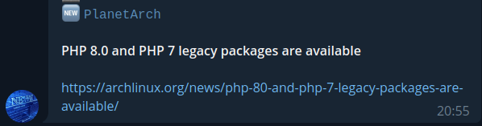

# RTT - Telegram feed reader

Simple Rss feed reader for telegram



## Usage

You need:

* `TGTOKEN` env variable, which is the bot apikye
* `TGCHAT` env variabile, which is the chat where the bot send the notifications, the bot must be a member
* `settings.py` file wich contain the rss feed links, see [example](./example-settings.py)

### Docker

docker compose example:

```shell
version: '3.3'
services:
  rtt:
    environment:
      - TGTOKEN=foo
      - TGCHATID=bar
    volumes:
      - "${PWD}/example-settings.py:/usr/src/app/settings.py"
      - rttdata:/tmp
    image: brokenpip3/rtt:0.0.1

volumes:
  rttdata:
```

### Kubernetes

See [kubernetes](./kubernetes) directory for example deployment

## Credits

[1](https://fedoramagazine.org/never-miss-magazines-article-build-rss-notification-system/)
